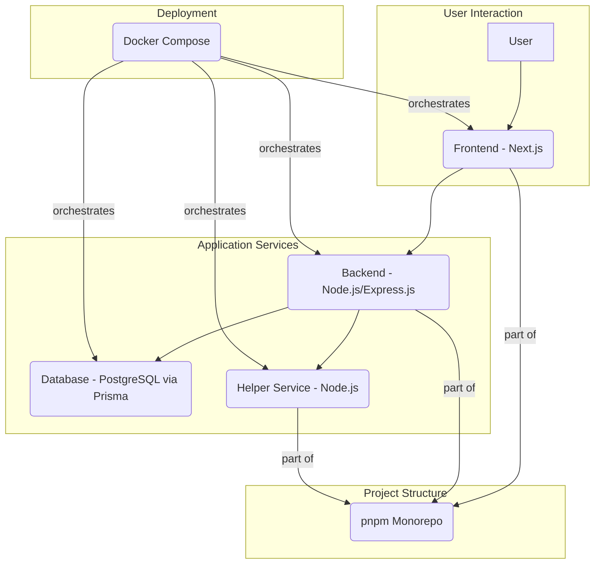

# Star-Lab: Lab Test Tracking

Star-Lab is a full-stack web application designed to streamline laboratory testing workflows. It features a robust backend API and a modern frontend for managing customer registration, test requests, lab processing, invoicing, and results delivery.

## Features

- **Role-Based Access Control:** Assign roles like `ADMIN`, `LAB_ADMIN`, `CUSTOMER`, `TECHNICIAN`, and `DOCTOR` to ensure secure access.
- **End-to-End Test Tracking:** Handle test requests from submission and payment to sample tracking, result uploads, and approval.
- **Customer & Doctor Portals:** Provide dedicated interfaces for customers and doctors to manage requests and review results.
- **Automated Invoicing:** Generate invoices, track payments, and manage billing seamlessly.
- **Comprehensive API:** RESTful API built with Express.js and TypeScript, offering endpoints for all functionalities.
- **Modern Frontend:** Responsive UI built with React, React Router, and Tailwind CSS.

## Tech Stack

### Monorepo

- **Tool:** pnpm workspaces

### Backend

- **Framework:** Express.js
- **Language:** TypeScript
- **ORM:** Prisma
- **Database:** PostgreSQL
- **Authentication:** JWT
- **API Documentation:** Swagger/OpenAPI

### Frontend

- **Framework:** NextJs
- **Styling:** Tailwind CSS

### Database Service

- **Technology:** Prisma for database migrations

### Helper Service

- **Technology:** Node.js with TypeScript

### Containerization

- **Tools:** Docker and Docker Compose

## Project Architecture



## Getting Started

### Prerequisites

- Node.js (v18 or higher)
- pnpm
- Docker and Docker Compose

### Installation & Setup

1. **Clone the repository:**

    ```bash
    git clone https://github.com/damrongsak/star-lab.git
    cd star-lab
    ```

2. **Install dependencies:**

    ```bash
    pnpm install
    ```

3. **Setup Environment Variables:**
    Configure `.env` files for `apps/backend` and `apps/frontend` as needed. Refer to their respective `README.md` files for details.

4. **Start the development environment:**

    ```bash
    docker-compose up -d
    ```

    - Backend: `http://localhost:5001`
    - Frontend: `http://localhost:5173`
    - API Docs: `http://localhost:5001/api-docs`

### Running Tests

Run backend unit tests:

```bash
cd apps/backend
pnpm test
```

## Working with the Monorepo (pnpm)

### Running Scripts in a Specific Package

- **Run `dev` for backend:**

  ```bash
  pnpm --filter backend dev
  ```

- **Run `build` for frontend:**

  ```bash
  pnpm --filter frontend build
  ```

### Adding/Removing Dependencies

- **Add a dependency:**

  ```bash
  pnpm --filter frontend add axios
  pnpm --filter backend add express
  ```

- **Add a dev dependency:**

  ```bash
  pnpm --filter backend add -D jest
  ```

- **Remove a dependency:**

  ```bash
  pnpm --filter frontend remove axios
  ```

### Running Commands in All Packages

Run a script across all packages:

```bash
pnpm -r run lint
```

### Cleaning `node_modules`

Remove all `node_modules`:

```bash
pnpm -r exec rm -rf node_modules
```

Reinstall dependencies:

```bash
pnpm install
```

For advanced usage, refer to the [pnpm documentation](https://pnpm.io/workspaces).

## How to Work with Your AI Assistant (Gemini)

### Best Practices

1. **Be Specific:** Provide detailed requests for better assistance.
2. **Provide Context:** Mention relevant files, functions, or endpoints.
3. **One Task at a Time:** Break complex changes into smaller tasks.
4. **Review Plans:** Confirm proposed plans before proceeding.

### Example Prompts

- **Adding a feature:** "Add a `GET /api/v1/customers/recent` endpoint to return the 5 most recently registered customers, accessible only to `ADMIN` users."
- **Writing tests:** "Write unit tests for `InvoiceService` covering `createInvoice` and `markAsPaid` methods."
- **Refactoring code:** "Refactor `getTestRequest` in `TestRequestController.ts` to include the assigned doctor's name in the response."
- **Frontend changes:** "Create a `/dashboard/reports` page displaying statistics from `GET /api/v1/invoices/statistics`, visible to `ADMIN` and `LAB_ADMIN` roles."

Collaborate effectively to build great solutions!

## Repository Structure

```bash
.
├── AGENTS.md
├── ARCHITECTURE_ANALYSIS.md
├── CLAUDE.md
├── GEMINI.md
├── INITIAL.md
├── PLANNING.md
├── PRPs
│   ├── EXAMPLE_multi_agent_prp.md
│   ├── document-request-list.md
│   └── templates
├── README.md
├── TASK-Overview.md
├── TASK.md
├── apps
│   ├── backend
│   ├── frontend
│   ├── helper-service
│   └── public
├── codex-exec.sh
├── codex-execution.log
├── codex-output.log
├── diagrams
│   └── codeviz-diagram-2025-08-12T14-11-09.drawio
├── docker-compose.overide.yml
├── docker-compose.yml
├── docs
│   ├── 01-01 Lab Tracking Web Application Development Plan.md
│   ├── 01-01 Lab Tracking Web Application Development Plan.pdf
│   ├── 02-01 Customer Registration & Profile Module Design Specification.pdf
│   ├── 02-02 Customer Portal Features Module Design Specification.pdf
│   ├── 03-01 Internal Lab User Management Module Design Specification.pdf
│   ├── 03-02 Lab Internal Operations Module Design Specification.pdf
│   └── 04-01 Doctor Approval Workflow Module Design Specification.pdf
├── examples
│   ├── GEMINI.md
│   ├── README.md
│   ├── backend
│   ├── frontend
│   ├── packages
│   └── pnpm-workspace.yaml
├── file-list.txt
├── node_modules
├── package.json
├── packages
│   └── shared
├── pnpm-lock.yaml
└── pnpm-workspace.yaml
```